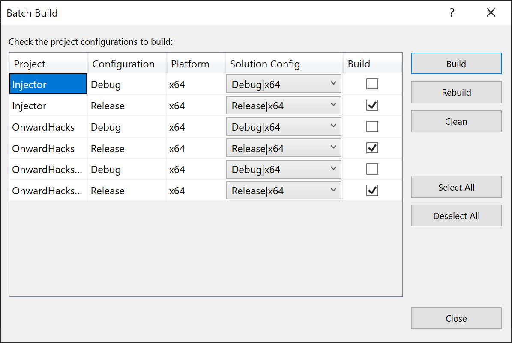

# Onward Hacks

## Features
1. ESP ✔
2. No Recoil ✔
3. Infinite Ammo ✔
4. 6 Round Burst ✔
5. Auto-Cap ✔
6. Maxed Health ❌
7. Maxed Damage ✔
8. Max Rate Of Fire ✔
-1. Disinject Hacks ✔
0. Help ✔

## Instructions for use
1. Run OnwardHacksInjector.exe while Onward is running
2. Click 1 to register or 2 to log in
3. Click enter when promppte to inject
4. Close original window
5. Click on the onward terminal that opened up
6. Type the number cooresponding to the option you would like and press enter

## Build Instruction
### Build All
1. Select Build, Batch Build
2. Select Below Config Options (You only need to do this once)

3. Click Build
4. Copy Injector.dll and OnwardHacks.dll from x64/Release and x64/Debug folders respectively
5. Paste in x64/Release/netcoreapp3.1
5. Run OnwardHacksInjector.exe, log in to Dev account and select 2 to build OnwardHacksEncrypted.dll
6. Close OnwardHacksInjector
7. Open OnwardHacksInjector, log in, and inject. (If a dev account you will need to press 1 when prompted)
8. Congratulate yourself for following these instructions
### Build specific
#### OnwardHacks
1. Right click on OnwardHacks project
2. Select "Set as Startup Project"
3. On the top Select Debug and x64
4. Click Build, Build, 2 OnwardHacks
#### Injector
1. Right click on Injector project
2. Select "Set as Startup Project"
3. On the top Select Release and x64
4. Click Build, Build, 1 Injector
#### OnwardHacksInjector
1. Right click on OnwardHacksInjector project
2. Select "Set as Startup Project"
3. On the top Select Release and x64
4. Click Build, Build, 3 OnwardHacksInjector
